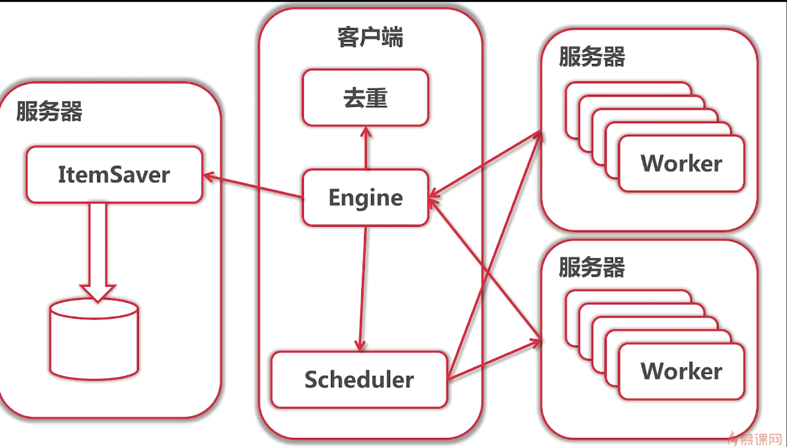

### go分布式爬虫

- 爬取某相亲网站数据，仅用于学习，数据存储至es，redis实现分布式去重，服务基于jsonrpc

- [学习来源(14-18章)](https://coding.imooc.com/class/180.html)
- [原老师项目仓库](https://github.com/fatrbaby/cobweb.git)

### 目录结构
- 数据存储服务ItemSaver入口文件 /distributed/persist/server/itemsaver.go
- 爬取服务Worker入口文件 /distributed/worker/server/worker.go
- 调度客户端Engine入口文件 /distributed/main.go
- web界面 /web
- 单机版启动入口文件 /main.go

### 启动
#### 配置
- redis监听6379,写死在/redisservice/redis.go下，用于存储数据去重
- elasticsarch监听9200，改动口留意/distributed/persist/server/itemsaver.go和/main.go
- es默认写入索引名配置在/config/config
#### 启动服务
- 单机版，直接根目录 `go run main.go`

- 分布式版结构如图
 
 
- ItemSaver服务主要负责去重并写入数据至es

   - 启动 `go run distributed/persist/server/itemsaver.go -port=8900`

- Worker主要负责拉取网页数据，并解析内容

   - 启动 两个

     `go run distributed/worker/server/worker.go -port=9000`

     `go run distributed/worker/server/worker.go -port=9001`

- Engine，主要负责调度各服务，分发任务给worker，并把解析得到的结果通过ItemSaver保存至es，这里并没有如图实现去重，去重交给了itemSaver处理。

   - 启动` go run distributed/main.go -itemsaver_host=":8900" -worker_hosts=":9000,:9001"`
   - 多个worker用逗号间隔

- web端
  - 启动 `go run web/main.go -port=9002`
  - 访问 http://localhost:9002/search
